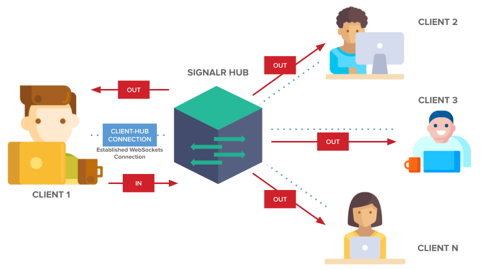
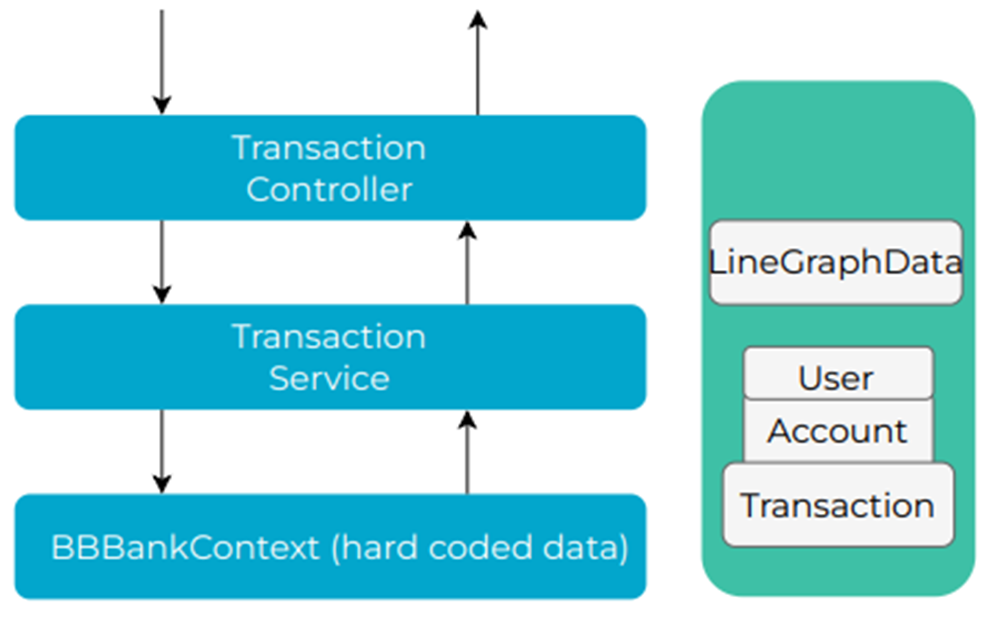
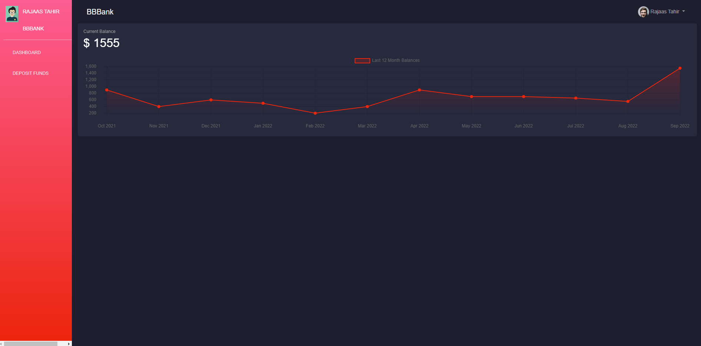

# SignalR with Real-Time Graph

## What is SignalR?
**SignalR is an open-source project that enables real-time, bi-directional web communication from server to client**. Using SignalR, you can write server-side code that can **communicate with the clients instantly**.

In typical web applications, the communication flow is one-way, i.e. from the client to the server. The client initiates a request to the server, the server performs some tasks and sends the response to the client.

SignalR simplifies the process of adding **real-time web functionality to web applications**, where the server code pushes content to connected clients as soon as it becomes available. This frees the clients from repeatedly polling the server and having the server wait for a client to request new data.

SignalR provides an API for creating server-to-client remote procedure calls (RPC) that call JavaScript code in the client browsers (and other client platforms) from server-side .NET code. SignalR also includes an API for connection management (for instance, connect and disconnect events), and grouping connections.

### **SignalR Uses Various Technologies**
SignalR uses various technologies to handle real-time communication from the server to the client such as:
* WebSockets
* Server-Sent Events
* Long Polling

It automatically selects the optimal transport method depending upon the capabilities of the server and clients.

### **Applications of SignalR**
Although a chat is a common example used for SignalR, you can do a whole lot more. Here are some excellent applications of SignalR.

* User notifications
* Sending high-frequency updates to clients
* Dashboards containing real-time charts and graphs
* Collaborative applications, such as chat and messaging services
* Games and entertainment applications
* Alerting mechanisms

---------------

## About this exercise
In this lab we will be working on two code Bases, **Backend Code base** and **Frontend Code Base**

## **Backend Code Base**
Previously we developed a base structure of an API solution in Asp.net core that have just two controllers i.e **AccountsController** and **TransactionController**. 

* **AccountsController** has a method `GetAccountByAccountNumber` which takes in account number as a parameter and returns the account matching it

* **TransactionController** has three methods. `GetLast12MonthBalances` and `GetLast12MonthBalances/{userId}` which returns data of the last 12 months total balances and a `Deposit` method deposits credit from one account to the other.

There are 4 Projects in the solution. 

*	**Entities** : This project **contains DB models** like User where each User has one Account and each Account can have one or many Transactions. There is also a Response Model of LineGraphData that will be returned as API Response. 

*	**Infrastructure**: This project **contains BBBankContext** that service as fake DBContext that populates one User with its corresponding Account that has three Transactions dated of last three months with hardcoded data. 

* **Services**: This project **contains TransactionService** with the logic of converting Transactions into LineGraphData after fetching them from BBBankContext.

* **BBBankAPI**: This project **contains controller** which are mentioned above 

-----------

## **Frontend Code Base**
Previously we scaffolded a new Angular application in which we have integrated 

* **FontAwesome** library for icons
* **Bootstrap library** for styling.
* **Toolbar** which contains the user profile 
*  **Side navigation bar** which contains the user name and image and two routs for **Dashboard and Deposit-funds**
*  **Dashboard** component contains the a graph which is populated with the `GetLast12MonthBalances` method

*  **Deposit-funds** component has the functionality to deposit funds from one account to the other
  

_____________

## **In this exercise**

  **Backend Code**
* We will **create a signalR resource** in the Azure
* **Install required packages**
* Add **configuration for signalR** in the `program.cs`
* Create a **TransactionHUB class**
* **Inject TransactionHUB with IHubContext** and modify the 
* We will **create an account service**  and a contract for this service in the **Service** project 
* We will **register this service in a pipeline** as scoped 
* We will **create an account controller**  with method **AccountNumberExists(string accountNumber)**
* We will **add some fake accounts** 

  **Frontend Code**
* We will **create an account service** 
* We will **create custom account number validator directive**  
* We will **add a template driven form** in the HTML file of appComponent 

## **Backend Implementation**
Follow the below steps to implement backend code for custom validation with debounce pattern 
