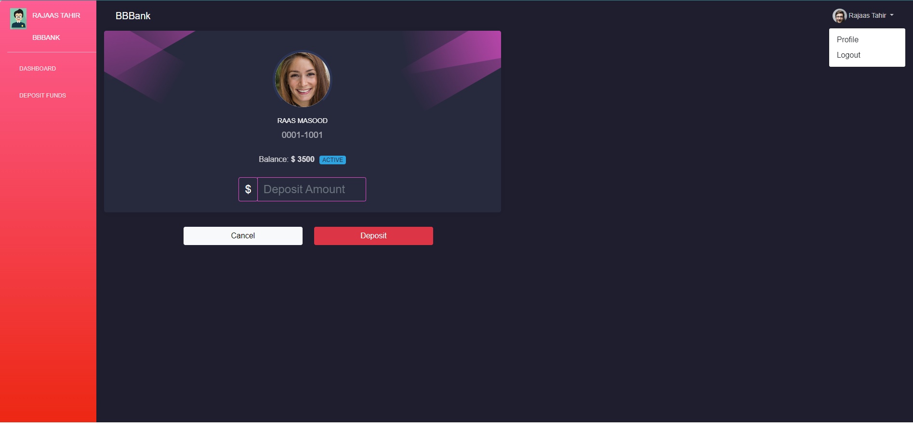

# SignalR with Real-Time Graph

## What is SignalR?
**SignalR is an open-source project that enables real-time, bi-directional web communication from server to client**. Using SignalR, you can write server-side code that can **communicate with the clients instantly**.

In typical web applications, the communication flow is one-way, i.e. from the client to the server. The client initiates a request to the server, the server performs some tasks and sends the response to the client.

SignalR simplifies the process of adding **real-time web functionality to web applications**, where the server code pushes content to connected clients as soon as it becomes available. This frees the clients from repeatedly polling the server and having the server wait for a client to request new data.

SignalR provides an API for creating server-to-client remote procedure calls (RPC) that call JavaScript code in the client browsers (and other client platforms) from server-side .NET code. SignalR also includes an API for connection management (for instance, connect and disconnect events), and grouping connections.


### **SignalR Uses Various Technologies**
SignalR uses various technologies to handle real-time communication from the server to the client such as:
* WebSockets
* Server-Sent Events
* Long Polling

It automatically selects the optimal transport method depending upon the capabilities of the server and clients.

### **Applications of SignalR**
Although a chat is a common example used for SignalR, you can do a whole lot more. Here are some excellent applications of SignalR.

* User notifications
* Sending high-frequency updates to clients
* Dashboards containing real-time charts and graphs
* Collaborative applications, such as chat and messaging services
* Games and entertainment applications
* Alerting mechanisms

---------------

## About this exercise
In this lab we will be working on two code Bases, **Backend Code base** and **Frontend Code Base**

## **Backend Code Base**
Previously we developed a base structure of an API solution in Asp.net core that have just two controllers i.e **AccountsController** and **TransactionController**. 

* **AccountsController** has a method `GetAccountByAccountNumber` which takes in account number as a parameter and returns the account matching it

* **TransactionController** has three methods. `GetLast12MonthBalances` and `GetLast12MonthBalances/{userId}` which returns data of the last 12 months total balances and a `Deposit` method deposits credit from one account to the other.


There are 4 Projects in the solution. 

*	**Entities** : This project **contains DB models** like User where each User has one Account and each Account can have one or many Transactions. There is also a Response Model of LineGraphData that will be returned as API Response. 

*	**Infrastructure**: This project **contains BBBankContext** that service as fake DBContext that populates one User with its corresponding Account that has three Transactions dated of last three months with hardcoded data. 

* **Services**: This project **contains TransactionService** with the logic of converting Transactions into LineGraphData after fetching them from BBBankContext.

* **BBBankAPI**: This project **contains controller** which are mentioned above 


-----------

## **Frontend Code Base**
Previously we scaffolded a new Angular application in which we have integrated 

* **FontAwesome** library for icons
* **Bootstrap library** for styling.
* **Toolbar** which contains the user profile 
*  **Side navigation bar** which contains the user name and image and two routs for **Dashboard and Deposit-funds**
*  **Dashboard** component contains the a graph which is populated with the `GetLast12MonthBalances` method


*  **Deposit-funds** component has the functionality to deposit funds from one account to the other
  


_____________

## **In this exercise**

  **Backend Code**
* We will **create a signalR resource** in the Azure
* **Install required packages**
* Add **configuration for signalR** in the `program.cs`
* Create a **TransactionHUB class**
* **Inject TransactionHUB with IHubContext** and modify the transaction service 

  **Frontend Code**
* **Install required packages**
* We will **create an signalR service** 
* We will **create an global service** 
* We will **subscribe the global service observable to initialize the graph**  

## **Backend Implementation**
Follow the below steps to implement backend code 

### **SignalR Resource**
Create a signalR resource in the Azure and copy its connection string for later use
  
### **Install required packages**
Install the given packages in the **Services** project of the solution from package manager consol  

```cs
Microsoft.Azure.SignalR
```

### **Configuration for signalR**
Add the connection string for the signalR in the `appSetting.json` file as given below

```json
"SignalRConnectionString": "Endpoint=https://************.service.signalr.net;AccessKey=4k1fcO4fUwzqmeSTi/CWrwr0E891PmXRf3lR5mlIvpU=;Version=1.0;",
```

Add configuration for signalR in the `program.cs` as given below

```cs
//Confiuration Builder based on AppSettings File
var appSettingsFileSettings = new ConfigurationBuilder()
    .SetBasePath(Directory.GetCurrentDirectory())
    .AddJsonFile("appsettings.json")
    .Build();

// builder.Services.AddScoped<ModuleLoader>();
var SignalRConString = appSettingsFileSettings["SignalRConnectionString"];
builder.Services.AddSignalR().AddAzureSignalR(SignalRConString);

//Adding signalr middleware
app.UseEndpoints(endpoints =>
{
    // letting application know about diffrent hubs in our aplicaiton 
    // mapping hub to a route (one route per hub)
    endpoints.MapHub<TransactionHUB>("/api/updateAll");
});
```

### **TransactionHUB Class**
Create a TransactionHUB class in the **Services** project. This class acts as a hub and responsible for sending data to the clients.

The code is given below
```cs
 public class TransactionHUB : Hub
    {
        public async Task Send()
        {
            // Call the broadcastMessage method to update clients.
            await Clients.All.SendAsync("updateGraphsData");
        }
    }
```

### **Modify Transaction Service**
Inject TransactionHUB with IHubContext and modify the **DepositFunds** method of the transaction service to send pass the function name as a first parameter and data as a second  

The code is given below
```cs
private readonly BBBankContext _bbBankContext;
        private readonly IHubContext<TransactionHUB> _transactionHubContext; 
        public TransactionService(BBBankContext BBBankContext, IHubContext<TransactionHUB> transactionHubContext)
        {
            _bbBankContext = BBBankContext;
            _transactionHubContext = transactionHubContext;
        }

public async Task<int> DepositFunds(DepositRequest depositRequest)
        {
            try
            {
                var account = _bbBankContext.Accounts.Where(x => x.AccountNumber == depositRequest.AccountId).FirstOrDefault();
                if (account == null)
                    return -1;
                else
                {
                    var transaction = new Transaction()
                    {
                        Id = Guid.NewGuid().ToString(),
                        TransactionAmount = depositRequest.Amount,
                        TransactionDate = DateTime.UtcNow,
                        TransactionType = TransactionType.Deposit
                    };
                    if (account.Transactions != null)
                        account.Transactions.Add(transaction);

                    // technically bank manager cannot access this function.
                    await _transactionHubContext.Clients.All.SendAsync("updateGraphsData", "userId123");

                    return 1;
                }
            }
            catch (Exception ex)
            {

                throw;
            }
        }
```

## **Frontend Implementation**
Follow the below steps to implement frontend code

### **Install Required Packages**
Install the signalR package from the command line 

```ts
npm i @microsoft/signalr
```

### **SignalR Service**
We will create an signalR service in the **services** folder. Open the integrated terminal by right clicking on the folder and run the given command  

```ts
ng generate service signalR
```
Add the given code in the service

```ts
@Injectable({
  providedIn: 'root'
})
export class SignalRService {
  private hubConnection: HubConnection;

  constructor(private globalService : GlobalService ) {
  }

  public connectToTransactionHub = () => {
    this.hubConnection = new HubConnectionBuilder()
      .withUrl(environment.apiUrlBase + 'updateAll',{
      })
      .build();
    this.hubConnection
      .start()
      .then(() => console.log('SignalR Connection Established', "BBBank"))
      .catch(err => console.log('Error while starting connection: ' + err, "BBBank"));
  }

  public addUpdateGraphsDataListener = () => {
    this.hubConnection.on('updateGraphsData', (userId : string) => {
     console.log('addUpdateGraphsDataListener', userId);
     
     this.globalService.sendData(userId);

    });
  }
}
```

### **Global Service**
We will create an global service in the **services** folder. Open the integrated terminal by right clicking on the folder and run the given command  

```ts
ng generate service global
```
Add the given code in the service

```ts
@Injectable({
  providedIn: 'root'
})
export class GlobalService {
  
  private dataSource: BehaviorSubject<string> = new BehaviorSubject<string>('');
  data: Observable<string> = this.dataSource.asObservable();

  constructor() { }

  sendData(data: string) {
    this.dataSource.next(data);
  }
}
```

### **Real-time Graph**
In the dashboard component, add the given method which will subscribe the global service observable and initializes the graph every time the funds are deposited. 

```ts
  getData() {
    this.globalService.data.subscribe(response => {
      console.log(response);  

      this.initializeGraph()
    });
  }
```

### Conclusion
abcd